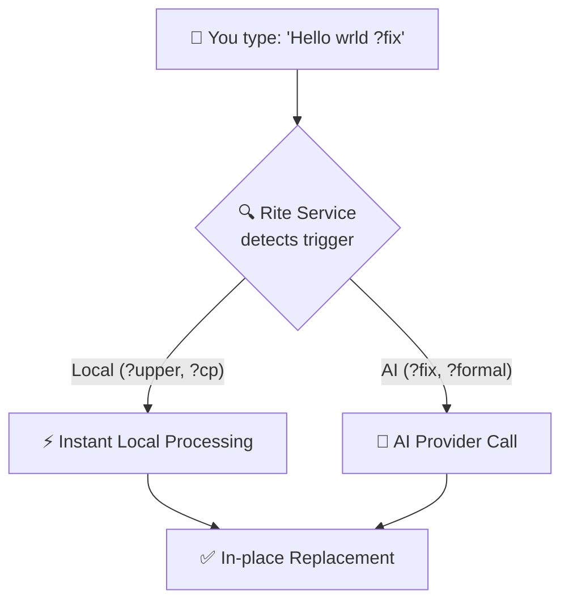

<div align="center">

<br>


<br>

# Rite

### System-wide AI & Utility Text Assistant for Android — Powered by Gemini

### Fork of SwiftSlate

Type a trigger like **`?fix`** or **`?upper`** at the end of any text, in any app, and watch it transform — instantly.

<br>

[](#-getting-started)
[](#%EF%B8%8F-tech-stack)
[](#-powered-by-gemini--custom-providers)
[](LICENSE)

[](https://github.com/catamsp/Rite/releases/latest)
[](#)
[](#)

<br>

[](https://github.com/catamsp/Rite/releases/latest)
&nbsp;&nbsp;
[](https://github.com/catamsp/Rite/issues)

<br>

</div>

> [!NOTE]
> **Rite works in most apps** — WhatsApp, Gmail, Twitter/X, Messages, Notes, and more. No copy-pasting. No app switching. Just type and go. Some apps with custom input fields may not be supported.

<br>

## 📋 Table of Contents

- [Quick Demo](#-quick-demo)
- [Features](#-features)
- [Built-in Commands](#-built-in-commands)
- [Local Utility Commands](#-local-utility-commands)
- [Getting Started](#-getting-started)
- [How It Works](#%EF%B8%8F-how-it-works)
- [Custom Commands](#-custom-commands)
- [Privacy & Security](#-privacy--security)
- [Tech Stack](#%EF%B8%8F-tech-stack)

<br>

## ⚡ Quick Demo

```text
📝  You type       →  "i dont no whats hapening ?fix"
✅  Result         →  "I don't know what's happening."

📝  You type       →  "urgent update ?upper"
✅  Result         →  "URGENT UPDATE"

📝  You type       →  "the meeting is ?date"
✅  Result         →  "the meeting is 2026-04-02 14:30"
```

<br>

## ✨ Features

<table>
<tr>
<td width="50%">

### 🌐 Works Everywhere
Integrates at the system level via Android's Accessibility Service. Works in **any app** — messaging, email, social media, notes, and browsers.

### ⚡ Instant Inline Replacement
Type, trigger, done. The AI or utility response replaces your text directly in the same field — no copy-pasting required.

### 🛠️ Local Power Tools
Beyond AI, Rite now includes local text utilities like clipboard management, case transformation, and date injection.

</td>
<td width="50%">

### 🤖 Gemini & Custom Providers
Powered by Google's Gemini API (Flash Lite, Preview, etc.). Or connect **any OpenAI-compatible endpoint** to use your own model.

### 🎨 Custom Commands
Create your own trigger → prompt pairs. Define `?poem` to turn text into poetry or `?eli5` to simplify complex topics.

### 🔒 Privacy-First
No analytics. No telemetry. No servers. Text is only sent to your chosen provider when a trigger is detected.

</td>
</tr>
</table>

<br>

## 🧩 Built-in Commands

Rite ships with AI-powered commands ready to use out of the box:

| Trigger | Action | Example |
|:--------|:-------|:--------|
| **`?fix`** | Fix grammar, spelling & punctuation | `i dont no whats hapening` → `I don't know what's happening.` |
| **`?formal`** | Rewrite in professional tone | `hey can u send me that file` → `Could you please share the file...` |
| **`?emoji`** | Add relevant emojis | `I love this new feature` → `I love this new feature! 🎉❤️✨` |
| **`?shorten`** | Shorten while keeping meaning | `I wanted to let you know...` → `I can't attend tomorrow's meeting.` |
| **`?translate:XX`** | Translate to any language | `Hello` **`?translate:es`** → `Hola` |
| **`?undo`** | Restore original text | Reverts the last replacement immediately |

<br>

## 🛠️ Local Utility Commands

These commands run **locally on your device** for instant text processing and clipboard management:

| Trigger | Action | Example |
|:--------|:-------|:--------|
| **`?cp`** | **Copy** text to clipboard | `Important Note ?cp` → Clipboard: "Important Note" |
| **`?ct`** | **Cut** text to clipboard | `Secret Key ?ct` → Clears text field & copies to clipboard |
| **`?pt`** | **Paste** from clipboard | `Look at this: ?pt` → "Look at this: [clipboard content]" |
| **`?del`**| **Delete** all text locally | `Messy text here ?del` → Clears the entire text field |
| **`?upper`**| Convert to **UPPERCASE** | `hello world ?upper` → `HELLO WORLD` |
| **`?lower`**| Convert to **lowercase** | `STAY CALM ?lower` → `stay calm` |
| **`?title`**| Convert to **Title Case** | `the great wall ?title` → `The Great Wall` |
| **`?date`** | Insert **Date & Time** | `Current time: ?date` → `Current time: 2026-04-02 14:30` |

<br>

## 🚀 Getting Started

### Installation

**1.** Download the latest APK from [**Releases**](https://github.com/catamsp/Rite/releases/latest)

**2.** Enable the Accessibility Service:
   - Go to **Settings** → **Accessibility**
   - Find **Rite Assistant**
   - Toggle **On**

**3.** (Optional) Add your Gemini API key in the **Keys** tab for AI features.

<br>

## ⚙️ How It Works



<br>

## 🔒 Privacy & Security

Rite is built with privacy as a core principle:
- **Zero Telemetry:** No tracking, no analytics, no crash reports.
- **On-Device Triggers:** Text is only processed when a trigger is detected.
- **Encrypted Keys:** API keys are stored in the Android Keystore using **AES-256-GCM**.
- **Direct Connection:** Rite talks directly to the AI provider. No intermediary servers.

<br>

## 🏗️ Tech Stack

- **Language:** Kotlin 2.1
- **UI:** Jetpack Compose (Material 3)
- **Networking:** Native `HttpURLConnection` (Zero external dependencies)
- **Security:** Android Keystore + AES-256-GCM
- **Min SDK:** Android 6.0 (API 23)

<br>

---

<div align="center">

Forked and vibe coded by [**catamsp**](https://github.com/catamsp)
All credits goes to [**Musheer Alam**](https://github.com/Musheer360)

If Rite makes your typing life easier, consider giving it a ⭐

</div>
