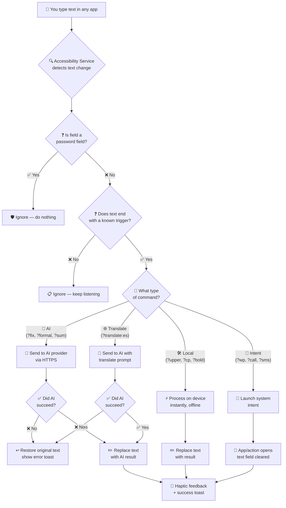

<div align="center">

<br>


<br>

# Rite

### System-wide AI & Utility Text Assistant for Android

Type a trigger like **`?fix`** or **`?upper`** at the end of any text, in any app, and watch it transform — instantly.

<br>

[](#-getting-started)
[](#%EF%B8%8F-tech-stack)
[](#-ai-providers)
[](#-ai-providers)
[](LICENSE)

[](https://github.com/catamsp/Rite/releases/latest)
[](#-requirements)

<br>

[](https://github.com/catamsp/Rite/releases/latest)
&nbsp;&nbsp;
[](https://github.com/catamsp/Rite/issues)

<br>

</div>

> [!NOTE]
> **Rite works in most apps** — WhatsApp, Gmail, Twitter/X, Messages, Notes, and more. No copy-pasting. No app switching. Just type and go. See [Known Limitations](#-known-limitations) for cases where it may not work.
>
> **Trigger Rule:** Commands must be preceded by a space. Type `hello ?fix` ✅, not `hello?fix` ❌. This prevents accidental triggers while typing normal text.

<br>

## 📋 Table of Contents

- [Quick Demo](#-quick-demo)
- [Features](#-features)
- [Complete Command Reference](#-complete-command-reference)
  - [AI Commands](#-ai-commands-requires-api-key)
  - [Local Utility Commands](#%EF%B8%8F-local-utility-commands-offline)
  - [Intent Commands](#-intent-commands-launch-apps--actions)
  - [Dynamic Translate](#-dynamic-translate)
  - [Alternate Modes: Append & Prepend](#%EF%B8%8F-alternate-modes-append--prepend)
  - [Custom Commands](#-custom-commands)
- [Known Limitations](#-known-limitations)
- [Getting Started](#-getting-started)
- [How It Works](#%EF%B8%8F-how-it-works)
- [Privacy & Security](#-privacy--security)
- [Changelog](#-changelog)
- [Tech Stack](#%EF%B8%8F-tech-stack)

<br>

## 🎬 Demo

### Screenshots

> [!NOTE]
> Screenshots may not reflect the latest UI updates including the monochrome theme, API Key Status card, and Commands screen refactor.

<p align="center">
  
  
  
</p>

### Video

<video src="https://github.com/catamsp/Rite/raw/main/demo/Video%201.mp4" controls muted loop width="100%"></video>

<br>

## ⚡ Quick Demo

```text
📝  You type       →  "i dont no whats hapening ?fix"
✅  Result         →  "I don't know what's happening."

📝  You type       →  "urgent update ?upper"
✅  Result         →  "URGENT UPDATE"

📝  You type       →  "meeting notes: ?date"
✅  Result         →  "meeting notes: 2026-04-04 15:30"

📝  You type       →  "?wp"
✅  Result         →  WhatsApp opens instantly

📝  You type       →  "?call"
✅  Result         →  Direct call to your configured number
```

<br>

## ✨ Features

<table>
<tr>
<td width="50%">

### 🌐 System-Wide Integration
Works via Android Accessibility Service in **any text field** — messaging, email, social media, notes, browsers.

### ⚡ Instant Inline Processing
Type a trigger and the text transforms right where you're typing. No copy-paste. No app switching.

### 🤖 AI + Local Commands
15+ AI-powered text transformations AND 20+ offline local utilities — all in one place.

</td>
<td width="50%">

### 🔌 Multiple AI Providers
Use **Google Gemini** or connect **any OpenAI-compatible API** (OpenAI, Claude, local LLMs, self-hosted).

### 📱 Launch Apps & Actions
Open apps, make calls, send SMS, compose emails, and visit URLs — all by typing a trigger.

### 📊 Real-Time Key Status
Dashboard shows which API keys are active ("Alive") and which are cooling down ("Resting") with live countdown timers.

### 🎨 Filtered Commands Tab
Browse commands with filter chips (All / AI / Local / Action). Add and edit custom commands via a clean popup dialog.

### 🔒 Privacy-First Design
Zero telemetry. Zero analytics. API keys encrypted in Android Keystore. All network traffic forced HTTPS.

</td>
</tr>
</table>

<br>

## 📖 Complete Command Reference

Rite has **four types of commands**: AI (cloud), Local (offline), Intent (launch apps), and Custom (user-defined).

### 🤖 AI Commands — Requires API Key

These send your text to the configured AI provider and return a transformed result. **Requires at least one API key** added in the Keys tab.

| Trigger | What It Does | Example |
|:--------|:-------------|:--------|
| **`?fix`** | Fix grammar, spelling & punctuation | `i dont no` → `I don't know` |
| **`?improve`** | Improve clarity and readability | Makes text clearer while keeping meaning |
| **`?shorten`** | Condense text, keep core meaning | Long paragraph → Concise summary |
| **`?expand`** | Add detail and elaboration | Short sentence → Detailed paragraph |
| **`?formal`** | Professional tone rewrite | `hey can u send` → `Could you please share` |
| **`?casual`** | Friendly casual tone | Formal text → Relaxed conversational style |
| **`?emoji`** | Add contextually relevant emojis | `Good morning` → `Good morning ☀️😊` |
| **`?reply`** | Generate contextual reply | Paste a message → Get a reply suggestion |
| **`?sum`** | Summarize text concisely | Long article → Key points summary |
| **`?bullet`** | Convert to bullet points | Paragraph → Clean bullet list |
| **`?rewrite`** | Rephrase naturally | Same meaning, different wording |
| **`?remove`** | Clean messy text | Remove extra spaces, dupes, junk |
| **`?tl`** | Translate to English (auto-detect) | Any language → English |
| **`?explain`** | Explain in simple terms | Complex text → Easy understanding |
| **`?fancy`** | Convert to fancy unicode font | `hello` → `𝒽𝑒𝓁𝓁𝑜` |

---

### 🛠️ Local Utility Commands — Offline

These run **entirely on your device**. No API key needed. No internet required. Instant response.

#### Clipboard Operations
| Trigger | What It Does | Example |
|:--------|:-------------|:--------|
| **`?cp`** | **Copy** text to clipboard | `API Key 12345 ?cp` → Copied |
| **`?ct`** | **Cut** text to clipboard | `Secret ?ct` → Cleared & copied |
| **`?pt`** | **Paste** from clipboard | `Ref: ?pt` → `Ref: [clipboard]` |
| **`?del`** | **Delete** all text | `anything here ?del` → Field cleared |

#### Text Transformation
| Trigger | What It Does | Example |
|:--------|:-------------|:--------|
| **`?upper`** | Convert to UPPERCASE | `hello` → `HELLO` |
| **`?lower`** | Convert to lowercase | `HELLO` → `hello` |
| **`?title`** | Convert to Title Case | `the big wall` → `The Big Wall` |

#### Text Formatting
| Trigger | What It Does | Example |
|:--------|:-------------|:--------|
| **`?trim`** | Clean extra spaces & empty lines | Messy spacing → Clean single spacing |
| **`?join`** | Join all lines into one paragraph | Multi-line → Single line |
| **`?split`** | Split long text into short lines (80 chars) | Long paragraph → Wrapped lines |
| **`?sort`** | Sort lines alphabetically | `c, a, b` → `a, b, c` |
| **`?dedupe`** | Remove duplicate lines | `a, a, b` → `a, b` |

#### Unicode & Encoding
| Trigger | What It Does | Example |
|:--------|:-------------|:--------|
| **`?bold`** | Convert to Unicode bold font | `hello` → `𝐡𝐞𝐥𝐥𝐨` |
| **`?italic`** | Convert to Unicode italic font | `hello` → `ℎ𝑒𝑙𝑙𝑜` |
| **`?rot13`** | ROT13 encode/decode text | `hello` → `uryyb` |
| **`?md5`** | Calculate MD5 hash of text | `hello` → `5d41402abc4b2a76b9719d911017c592` |
| **`?upside`** | Flip text upside down | `hello` → `ollǝɥ` |
| **`?mirror`** | Reverse text character by character | `hello` → `olleh` |
| **`?reverse`** | Reverse word order | `hello world` → `world hello` |

#### Meta & Info
| Trigger | What It Does | Example |
|:--------|:-------------|:--------|
| **`?date`** | Insert current date & time | `Meeting: ?date` → `Meeting: 2026-04-04 15:30` |
| **`?time`** | Insert current time only | `Call at ?time` → `Call at 15:30` |
| **`?count`** | Show word & character count | `hello world ?count` → `hello world [2 words \| 11 chars]` |

#### Control
| Trigger | What It Does |
|:--------|:-------------|
| **`?undo`** | Undo the last AI/local replacement and restore original text |

---

### 📱 Intent Commands — Launch Apps & Actions

These launch system actions or apps. Configure them in the **Commands** tab as **custom commands**:

| Trigger | Prompt (what you configure) | What Happens |
|:--------|:----------------------------|:-------------|
| `?wp` | `app:com.whatsapp` | Opens WhatsApp |
| `?ig` | `app:com.instagram.android` | Opens Instagram |
| `?yt` | `app:com.google.android.youtube` | Opens YouTube |
| `?tg` | `app:org.telegram.messenger` | Opens Telegram |
| `?phone` | `tel:+919876543210` | Direct call (requires Phone permission) |
| `?sms` | `sms:+919876543210` | Opens SMS composer |
| `?mail` | `mailto:user@email.com` | Opens email composer |
| `?google` | `https://google.com` | Opens URL in browser |

> [!TIP]
> **To find an app's package name:** Open Play Store → Search the app → Look at the URL → `id=` value is the package name. Example: `play.google.com/store/apps/details?id=com.whatsapp` → package name is `com.whatsapp`

---

### 🌐 Dynamic Translate

Translate to **any language** by typing `?translate:` followed by the 2-letter language code:

| What You Type | Result |
|:--------------|:-------|
| `Hello ?translate:es` | `Hola` |
| `Hello ?translate:fr` | `Bonjour` |
| `Hello ?translate:ja` | `こんにちは` |
| `Hello ?translate:hi` | `नमस्ते` |
| `Hello ?translate:de` | `Hallo` |

Works with append/prepend modes too: `!translate:fr`, `+translate:es`

---

### ⚙️ Alternate Modes: Append & Prepend

By default, triggers use **`?`** (replace mode). You can change the behavior:

| Mode Prefix | Behavior | Example |
|:------------|:---------|:--------|
| **`?fix`** (default) | **Replace** — result replaces the text | `hello ?fix` → `Hello.` |
| **`!fix`** | **Append** — result added after original text | `hello !fix` → `hello\nHello.` |
| **`+fix`** | **Prepend** — result added before original text | `hello +fix` → `Hello.\nhello` |

Works with **all** AI and local commands.

---

### 🎨 Custom Commands

Create your own trigger → prompt pairs in the **Commands** tab:

1. Open Rite → go to **Commands** tab
2. Tap the **`+`** icon in the top-right corner
3. Enter a **Trigger** (e.g., `?poem`) and a **Prompt** (e.g., `Convert this text into a short beautiful poem`)
4. Tap **Save**
5. Use it anywhere: type your text ending with `?poem`

**Filter your commands** using the chips at the top: **All** · **AI** · **Local** · **Action**

**Edit or delete** custom commands using the ✏️ and 🗑️ icons next to each entry.

**Custom intent commands** let you launch apps, make calls, etc. by setting the prompt to `app:com.package`, `tel:number`, `sms:number`, `mailto:email`, or `https://url`.

<br>

## ⚠️ Known Limitations

### Text Fields That May Not Work

Rite uses Android's Accessibility Service to read text fields. Most standard `EditText` and `TextField` inputs work perfectly, but **some apps use custom input fields** that don't expose text to the accessibility framework:

| App / Scenario | Status | Why |
|:---------------|:-------|:----|
| WhatsApp, Telegram, Signal | ✅ Works | Standard input fields |
| Gmail, Outlook | ✅ Works | Standard input fields |
| Google Messages, Samsung Messages | ✅ Works | Standard input fields |
| Google Keep, Samsung Notes | ✅ Works | Standard input fields |
| Chrome URL bar | ✅ Works | Standard input fields |
| **Some game chat boxes** | ❌ May not work | Custom input rendering |
| **Apps with custom IME/keyboard** | ❌ May not work | Bypass accessibility text |
| **Certain banking apps** | ❌ May not work | Enhanced security blocks |
| **WebView-based apps** | ⚠️ Hit or miss | Depends on WebView accessibility |
| **Password fields (any app)** | 🛡️ Intentionally blocked | Rite never reads password fields |

### Platform Limitations

| Limitation | Explanation |
|:-----------|:------------|
| **Gemini API key sent as URL parameter** | Google's Gemini API only supports `?key=...` in the URL. The key is encrypted in transit (HTTPS) but may appear in URL logs. This is a Google API design limitation, not a Rite issue. OpenAI-compatible providers use secure `Authorization` headers instead. |
| **Clipboard is system-wide** | When you use `?cp` or `?ct`, the copied text is in Android's system clipboard. Any app with `READ_CLIPBOARD` permission can read it. This is an Android platform limitation. |
| **Custom text fields** | Apps using custom input views (not standard Android `EditText`) may not expose text to accessibility services. |
| **`QUERY_ALL_PACKAGES` permission** | Required on Android 11+ to launch other apps by package name. This is an Android restriction — without it, `getLaunchIntentForPackage()` always returns null for third-party apps. |
| **CALL_PHONE runtime permission** | Direct calling (`tel:`) requires the user to manually grant the Phone permission in Settings. This is an Android security requirement. |

### What Rite Does NOT Do

- ❌ Rite does **not** record or store anything you type
- ❌ Rite does **not** read password fields
- ❌ Rite does **not** send anything to any server unless a trigger is detected
- ❌ Rite does **not** have analytics, telemetry, or crash reporting
- ❌ Rite does **not** modify any text unless you explicitly type a trigger

<br>

## 🚀 Getting Started

### Requirements

- **Android 6.0 (API 23)** or higher
- **Internet connection** (only for AI commands — local commands work offline)
- At least one **API key** (for AI commands only)

### Installation

**1.** Download the latest APK from [**Releases**](https://github.com/catamsp/Rite/releases/latest)

**2.** Install the APK on your Android device

**3.** Enable the Accessibility Service:
   - Open **Rite** → go to **Dashboard** tab
   - Tap **Enable** → or go to **Settings → Accessibility → Rite Assistant** → Toggle **On**
   - Confirm the security warning prompt

**4.** Add an API key (for AI commands):
   - Open Rite → **Keys** tab
   - Paste your Gemini or OpenAI-compatible API key
   - Tap **Add Key**

**5.** Start using — type anywhere with a trigger!

### Getting an API Key

- **Google Gemini (free):** [aistudio.google.com](https://aistudio.google.com/apikey) → Create API key
- **OpenAI:** [platform.openai.com/api-keys](https://platform.openai.com/api-keys)
- **Any OpenAI-compatible provider:** Get the base URL and API key from your provider

<br>

## ⚙️ How It Works



### Trigger Detection

Rite monitors text changes in real-time but only acts when:
1. The last character typed matches the end of a known trigger
2. The full text matches a trigger pattern (exact suffix match)
3. The text field is NOT a password field

This ensures Rite only processes text when you intentionally type a trigger — never otherwise.

<br>

## 🔒 Privacy & Security

Rite is built with privacy as a core principle, not an afterthought.

### What We Protect

| Area | How We Protect It |
|:-----|:------------------|
| **Password fields** | Rite **never reads or modifies** password fields. Every command checks `isPassword` and returns immediately if detected. |
| **API key storage** | Keys are encrypted using **AES-256-GCM** with keys generated and stored in **Android Keystore** (hardware-backed on supported devices). If the Keystore fails, Rite **refuses to store keys** rather than saving them in plain text. |
| **Cloud backup** | Encrypted API keys are **excluded** from both cloud backup and device transfer via `data_extraction_rules.xml`. |
| **Network traffic** | All connections are **forced HTTPS**. A `network_security_config.xml` with `cleartextTrafficPermitted="false"` blocks any HTTP (non-encrypted) connection attempt. |
| **API key in transit** | Gemini keys are URL-encoded for safe transmission. OpenAI-compatible providers use the `Authorization: Bearer` header (industry standard). |
| **Debug logging** | User data logging is **disabled by default** (`ENABLE_DEBUG_LOGGING = false`). No typed text, commands, or sensitive data appears in `logcat` in production builds. |
| **Own-app isolation** | Rite **ignores its own text fields** — it never intercepts text typed inside the Rite app itself. |
| **Zero telemetry** | No analytics SDK. No crash reporting. No usage tracking. Nothing leaves your device except text you explicitly send to an AI provider via a trigger. |

### Known Security Trade-offs

These are platform-level limitations that cannot be fixed without changes from Google/Android:

| Trade-off | Details |
|:----------|:--------|
| **Gemini API key in URL** | Google's Gemini API only accepts keys as URL query parameters (`?key=...`). While the connection is HTTPS-encrypted, the full URL may appear in DNS logs, proxy logs, or Android network stats. **Mitigation:** Use rotated/short-lived API keys. OpenAI-compatible providers use secure `Authorization` headers instead. |
| **Clipboard visibility** | When Rite copies text (`?cp`, `?ct`), it's placed in Android's system clipboard. Any app with `READ_CLIPBOARD` permission can read it. This is an Android platform behavior. |
| **QUERY_ALL_PACKAGES permission** | Required on Android 11+ to launch third-party apps by package name. This allows Rite to see all installed apps. Without it, `getLaunchIntentForPackage()` returns null for every app except system apps. |

### What Data Leaves Your Device

Only when you type a trigger:

| Command Type | Where Text Goes | What's Sent |
|:-------------|:----------------|:------------|
| AI commands (`?fix`, `?formal`, etc.) | Your configured AI provider | Your text + command prompt |
| Translate (`?translate:XX`) | Your configured AI provider | Your text + translate instruction |
| Local commands (`?upper`, `?cp`, etc.) | **Nowhere** — processed on device | Nothing leaves your device |
| Intent commands (`?wp`, `?call`) | **Nowhere** — launches system intent | Nothing leaves your device |

<br>

## 📝 Changelog

### v2.0.1 — UI Polish & Reliability

#### New Features
- **API Key Status card** — Dashboard now shows each key's status ("Alive" or "Resting") with live countdown timers for rate-limited keys
- **Filtered Commands tab** — Filter commands by type: All · AI · Local · Action using scrollable filter chips
- **Edit custom commands** — Tap the ✏️ icon to edit any custom command's trigger and prompt
- **Popup dialog for commands** — Add and edit commands via a clean popup dialog instead of a permanent form

#### Bug Fixes
- **Space-before-trigger requirement** — Commands now require a space before the trigger (e.g., `hello ?fix`) to prevent accidental triggers during normal typing
- **Paste command for Android 13+** — `?pt` now uses `ACTION_PASTE` instead of reading clipboard directly, bypassing Android 13+ clipboard restrictions
- **Race condition in `isProcessing`** — Replaced `@Volatile` with `AtomicBoolean` to prevent text corruption during rapid commands
- **Intent command text clearing** — Launching an intent now clears the text field instead of leaving leftover text
- **`?trim` whitespace handling** — Now handles all whitespace (spaces, tabs, newlines), not just multiple newlines
- **`?count` on empty text** — Shows "No text to count" instead of `[0 words | 0 chars]`
- **Keystore failure handling** — App now shows a friendly warning instead of crashing when device security chip is unavailable
- **Vibration code cleanup** — Removed duplicated API-level branches for cleaner haptic feedback

#### UI/UX Improvements
- **Monochrome theme** — Unified card colors across all screens; replaced colored indicators with white/grey monochrome
- **Commands screen redesign** — Compact list view with type badges, filter chips, and inline edit/delete actions
- **Settings card colors fixed** — All Settings cards now match the dark monochrome theme

---

### v2.0 — Current

#### New Features
- **OpenAI-compatible provider support** — Connect any OpenAI-compatible API endpoint with custom model selection
- **Intent commands** — Launch apps (`app:`), make calls (`tel:`), send SMS (`sms:`), compose emails (`mailto:`), open URLs (`https://`) via custom commands
- **Append/Prepend modes** — Use `!` prefix to append results after text, `+` prefix to prepend results before text
- **Custom command creation** — Add user-defined trigger → prompt pairs through the Commands tab
- **Dynamic language translate** — `?translate:XX` translates to any language code instantly
- **Haptic feedback** — Confirmation/rejection vibrations with API-level appropriate effects
- **Animated overlay toasts** — Slide-in notifications with smooth animations
- **Dashboard** — Real-time service status, key count, and usage instructions
- **Settings screen** — Provider selection, model picker, custom endpoint/model input, trigger prefix customization

#### Bug Fixes
- **Unicode bold/italic** — Fixed Supplementary Plane character handling using proper surrogate pairs (`Character.toChars`)
- **ROT13 encoding** — Fixed Char vs Int type mismatch causing garbled output
- **Paste command logic** — Fixed `?pt` to properly read and paste clipboard content
- **Local commands routing** — Fixed missing commands from `LOCAL_COMMANDS` set that were incorrectly routing to AI
- **Intent command blocking** — Fixed `triggerLastChars` filter that blocked intent commands before they could be processed
- **App self-interception** — Fixed Rite intercepting its own text fields during command setup
- **Text replacement fallback** — Added clipboard-based fallback when `ACTION_SET_TEXT` fails on certain apps

#### Security Improvements
- **Removed debug logging** — All user data logging disabled by default (`ENABLE_DEBUG_LOGGING = false`)
- **Key encryption fallback removed** — API keys now fail securely instead of falling back to plain text if Keystore is unavailable
- **Network security config** — Added `network_security_config.xml` enforcing HTTPS-only for all connections
- **Cleartext traffic blocked** — All HTTP connections rejected at the system level
- **API key URL encoding** — Gemini API keys properly URL-encoded before transmission
- **Security awareness card** — Dashboard now displays transparency notes about all security behaviors and platform limitations
- **Data extraction exclusion** — API keys excluded from cloud backup and device transfer
- **QUERY_ALL_PACKAGES permission** — Properly declared with tools:ignore for Play Store compliance

#### UI/UX Improvements
- **Complete command reference** — All commands now documented with examples
- **Provider selection** — Switch between Google Gemini and custom OpenAI-compatible providers
- **Model selection** — Choose from multiple Gemini models or specify custom model IDs
- **Trigger prefix customization** — Change the default `?` to any symbol
- **Bottom navigation** — Clean tab-based navigation between Dashboard, Keys, Commands, and Settings
- **Dark mode support** — Full Material 3 dark theme support

---

### v1.0 — Initial (SwiftSlate fork)

- Original Accessibility Service-based text transformation
- Google Gemini API integration
- Basic local commands (copy, cut, paste, delete)
- API key encryption via Android Keystore
- Custom command support

<br>

## 🏗️ Tech Stack

| Layer | Technology |
|:------|:-----------|
| **Language** | Kotlin |
| **Min SDK** | Android 6.0 (API 23) |
| **Target SDK** | API 36 |
| **UI** | Jetpack Compose (Material 3) |
| **Navigation** | Jetpack Navigation Compose |
| **Networking** | Native `HttpURLConnection` (zero external dependencies) |
| **Async** | Kotlin Coroutines + SupervisorJob |
| **Security** | Android Keystore + AES-256-GCM |
| **Storage** | SharedPreferences (encrypted for keys) |

<br>

---

<div align="center">

Built by [**catamsp**](https://github.com/catamsp) · Vibe Coded 🎨

Forked from [**SwiftSlate**](https://github.com/Musheer360) by [**Musheer Alam**](https://github.com/Musheer360)

If Rite makes your typing life easier, consider giving it a ⭐

</div>
